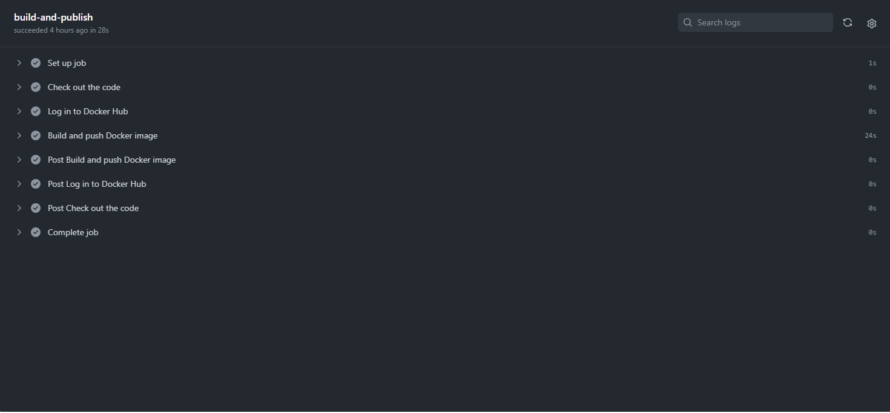
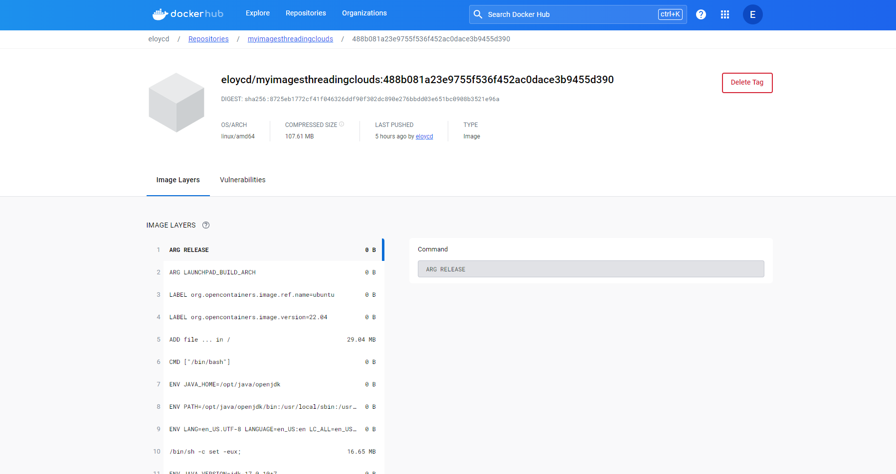
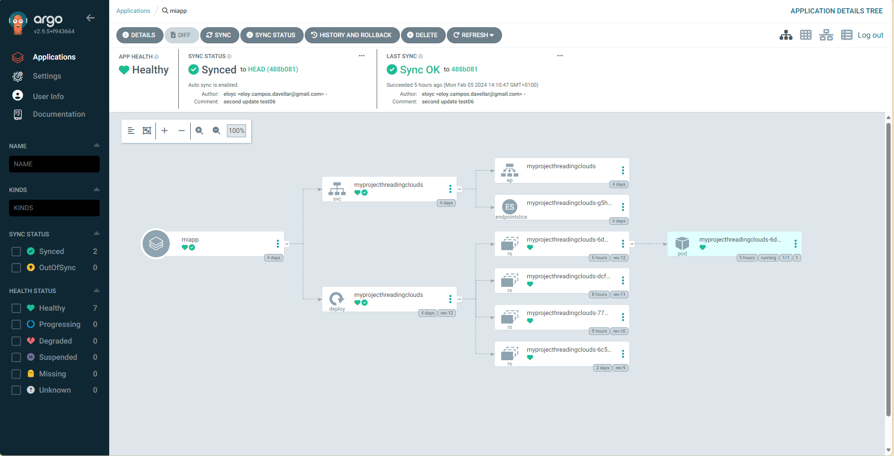

## Tools

- Docker: For containerization and running Kubernetes clusters. 

- Kind (Kubernetes IN Docker): For local Kubernetes cluster setup.
- Helm: For package management in Kubernetes.
- Prometheus, Grafana, and ArgoCD: For monitoring and deployment management.
- Java and Spring Boot: For application development.
- Dockerfile: For creating Docker images.
- GitHub Actions: For CI/CD pipelines.
 - ArgoCD: For continuous deployment.

 ## Development

**_Setting Up the Environment_**:

- Ensure Docker is installed and running.
- Install kubectl for Kubernetes command-line tool.

**_Creating a Kubernetes Cluster with Kind_**

- Create a cluster using kind create cluster.


**_Installing Helm and Setting Up Charts_**

- Install Helm if not already available.

**_Create a Terraform Configuration File (main.tf) for each of the components (Prometheus, Grafana, ArgoCD)_**.

- Prometheus: Use the Helm module to install Prometheus. You'll need to add the Helm chart for Prometheus to your configuration.

- Grafana: Similar to Prometheus, use the Helm module to install Grafana.

- Again, use the Helm module to install ArgoCD in your cluster.

**_Apply Your Configuration_**:

- Initialize Terraform with terraform init to prepare your environment.

- Apply your configuration with terraform apply. Terraform will create the resources on your Kubernetes cluster based on the provided definitions.

```
terraform {
  required_providers {
    kind = {
        source = "tehcyx/kind"
        version = "0.0.13"
    }
  }
}

# Configure the Kind Provider
provider "kind" {}

# Create a cluster
resource "kind_cluster" "default" {
    name = "test-cluster"
}

provider "helm" {
  kubernetes {
    config_path = "./test-cluster-config"
  }
  
}

resource "helm_release" "grafana" {
  name       = "grafana"
  repository = "https://grafana.github.io/helm-charts"
  chart      = "grafana"

}

resource "helm_release" "prometheus" {
  name       = "prometheus"
  repository = "https://prometheus-community.github.io/helm-charts"
  chart      = "prometheus"

}

resource "helm_release" "argocd" {
  name       = "argocd"
  repository = "https://argoproj.github.io/argo-helm"
  chart      = "argo-cd"

}
```

**_Configuring a Java Application with Spring Boot_**:

- Initialize a Spring Boot project with required dependencies.

```

package com.example.demo;

import org.springframework.boot.SpringApplication;
import org.springframework.boot.autoconfigure.SpringBootApplication;

@SpringBootApplication
public class DemoApplication {

	public static void main(String[] args) {
		SpringApplication.run(DemoApplication.class, args);
	}

}

```

- Use application.properties or application.yml for configuration settings.

```
apiVersion: apps/v1
kind: Deployment
metadata: 
  name: myprojecthreadingclouds
spec:
  replicas: 1
  revisionHistoryLimit: 3
  selector: 
    matchLabels:
      app:  test
  template:
    metadata:
      labels:
        app:  test
    spec:
    
      containers: 
      - image: eloycd/myimagesthreadingclouds:e0f538134569887649e6cd7fd5aad2f14e90950b
        imagePullPolicy: Always
        name:  myprojecthreadingclouds
        ports:
        - containerPort: 8080
---

apiVersion: v1
kind: Service
metadata:
  name: myprojecthreadingclouds
spec:
  ports:
  - port: 80
    targetPort: 8080
  selector:
    app: test

```

**_Packaging the Application with Docker_**:

- Create a Dockerfile in your project root.
- Specify base image, environment variables, dependencies, copy application files, expose ports, and define the entry point.
- Build the Docker image: docker build -t [IMAGE_NAME]:[TAG] .

```
FROM eclipse-temurin:17-jdk-jammy AS build
ENV HOME=/usr/app
RUN mkdir -p $HOME
WORKDIR $HOME
ADD . $HOME
RUN --mount=type=cache,target=/root/.m2 ./mvnw -f $HOME/pom.xml clean package

#
# Package stage
#
FROM eclipse-temurin:17-jre-jammy 
ARG JAR_FILE=/usr/app/target/*.jar
COPY --from=build $JAR_FILE /app/runner.jar
EXPOSE 8080
ENTRYPOINT java -jar /app/runner.jar

```


**_Automating Deployment with GitHub Actions_**:

- In your GitHub repository, create a workflow under .github/workflows with YAML syntax.

```
name: Build and Publish Docker image

on:
  push:
    branches:
      - main  

jobs:
  build-and-publish:
    runs-on: ubuntu-latest
    steps:
      - name: Check out the code
        uses: actions/checkout@v2

      - name: Log in to Docker Hub
        uses: docker/login-action@v1
        with:
          username: ${{ secrets.DOCKER_USERNAME }}
          password: ${{ secrets.DOCKER_PASSWORD }}

      - name: Build and push Docker image
        uses: docker/build-push-action@v2
        with:
          context: ./app
          file: ./app/Dockerfile  
          push: true
          tags: ${{ secrets.DOCKER_USERNAME }}/myimagesthreadingclouds:${{ github.sha }}

```


- Define triggers (e.g., on push to main branch), jobs, steps, and actions (e.g., build, test, deploy).



**_Continuous Deployment with ArgoCD_**:

- After pushing changes, ensure your Docker image is updated and tagged appropriately.

- Update deploy.yaml in your repository with the new image tag.



- ArgoCD will detect changes and synchronize, deploying the new version automatically.




